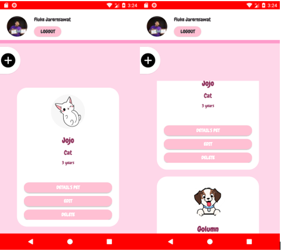
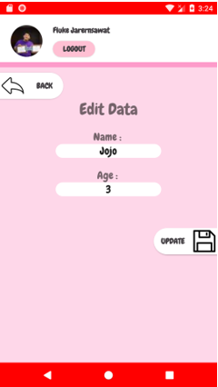
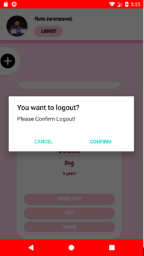
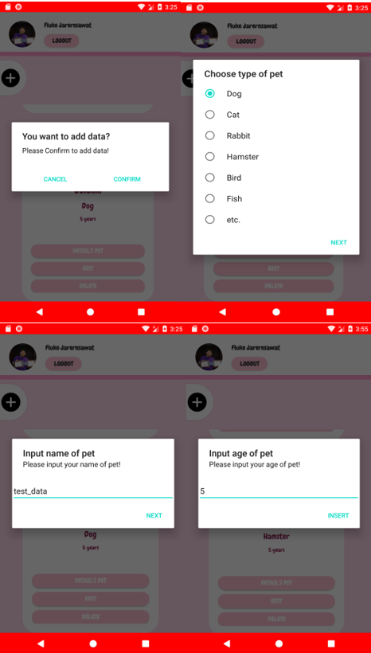

ระบบร้านรับฝากสัตว์เลี้ยง

1.	Introduction

เนื่องจากปัจจุบันมีจำนวนผู้คนที่เลี้ยงสัตว์เป็นจำนวนมาก และพบปัญหาในการที่จะต้องเดินทางไปทำธุระที่ต่างจังหวัดแล้วไม่สามารถนำสัตว์เลี้ยงเดินทางไปด้วยได้
ดังนั้นผู้จัดทำจึงได้พัฒนาระบบร้านรับฝากสัตว์เลี้ยงขึ้นมา เพื่ออำนวยความสะดวกต่อผู้ที่สนใจที่จะนำสัตว์เลี้ยงของตนมาฝากไว้ในกรณีที่ต้องเดินทางไปต่างจังหวัด 

2.	องค์ประกอบที่ในการพัฒนาแอปพลิเคชัน
- Fragment view
-	Login Facebook Authen
- Recycler view
- Realtime database (show, insert, update, delete)
- Dialog alert
    
3.	หน้าจอผลลัพธ์ ของแอปพลิเคชัน

        3.1 ส่วนของหน้าจอ login , facebook firebase authentication
  
  
    3.2 ส่วนของรายการ โดยแสดงข้อมูลจาก firebase Realtime database กับ Recycler view
  
  
    3.3 ส่วนของรายการแก้ไขและอัพเดท โดยอัพเดทข้อมูลใน firebase Realtime database ด้วย
  
  
    3.4 ส่วนของ dialog confirm logout
  
  
    3.5 ส่วนของ dialog input form
  

